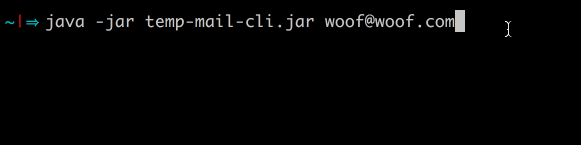

# temp-mail-cli

A command line tool to support http://temp-mail.org

## Installation

Download a demo .jar from https://marsha88.github.io/projects/temp-mail-cli.jar

## Usage

Generating a temporary email

`$ java -jar temp-mail-cli.jar`

Fetching email's inbox

`$ java -jar temp-mail-cli.jar email@example.com`

## Examples

Generating a Temporary Email

Fetching Email's Inbox

## License

Copyright © 2019 FIXME

This program and the accompanying materials are made available under the
terms of the Eclipse Public License 2.0 which is available at
http://www.eclipse.org/legal/epl-2.0.

This Source Code may also be made available under the following Secondary
Licenses when the conditions for such availability set forth in the Eclipse
Public License, v. 2.0 are satisfied: GNU General Public License as published by
the Free Software Foundation, either version 2 of the License, or (at your
option) any later version, with the GNU Classpath Exception which is available
at https://www.gnu.org/software/classpath/license.html.
